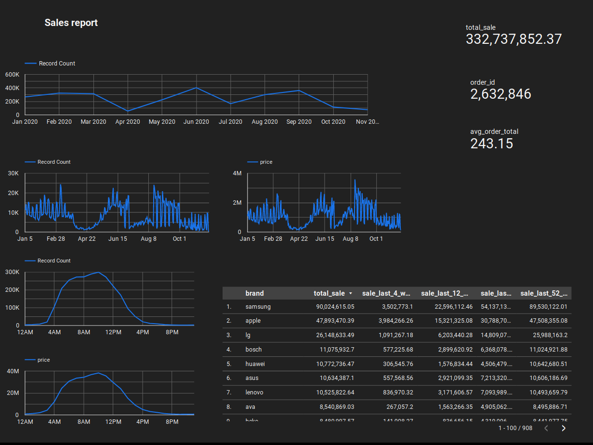

# Problem statement
This project aims at exploring how bussinesses can use data engineering tools to quickly setup and understand their operations better using data. By using data bussinesses can shift from making decsions from biased gut feeling to data leveraged insights.
Here are some example quetions ecommerse Bussiness operator would be interested in understanding.
- Sales: How much revenue is the eCommerce business generating? What are the top-selling products? What are the trends in sales over time?
- Customer Acquisition: How are customers finding the eCommerce business? What channels are most effective for acquiring new customers? What is the customer acquisition cost (CAC)?
- Inventory Management: How much inventory is available? What is the turnover rate for each product? What are the inventory carrying costs? What is the lead time for replenishing inventory?
- Shipping and Fulfillment: How long does it take to fulfill orders? What is the shipping cost for each order? What is the return rate? What is the customer satisfaction rate for shipping and fulfillment?


# Dataset
In this project we are using sales data as an example. Every day at the end of bussiness day, new sales data would be generated. And we can schedule batch job to generate insights.

We are using [eCommerce purchase history from electronics store](https://www.kaggle.com/datasets/mkechinov/ecommerce-purchase-history-from-electronics-store) data. This dataset contains purchase data from April 2020 to November 2020 from a large home appliances and electronics online store. 

## Overview


1. Data ingestion - Download dataset and ingest it in data lake(GCP Bucket)
2. Data warehouse - This data is imported into Big Query for performing anlytics.
3. Transformations - We are using dbt to transform data to suitable schema and store in BigQuery.
4. Dashboard - Looker Studio, formerly Google Data Studio is using as a dashboard to visualize the results.

## 1. Data ingestion
Data source contains single csv file of purchase history. 

Frequency of data download:
    since this is an static data from kaggle it can be imported only once. But in real usecase new data would be downloaded daily.

Extract step code is in [01_kaggle_dataset](./01_kaggle_dataset/)
And code for importing data into bigquery is in [02_gcp](./02_gcp/) 

## 2. Data warehouse
We are using BiqQuery as a Data Warehouse and it is used as data source in looker (Dashboard).

## 3. Transformations using dbt
DBT transformation code can be found in [04_dbt_project](./04_dbt_project/). 
The staging model has structure similar to data source. The `sales` table is partitioned on column `event_time` as this columns is frequently used to filter out relevent time period.

The core model sales_changes computes sales for diffrent time windows.


## 4. Dashboard 


Pdf of the dashboard can be found [here](./05_dashboard/DE_Sales_Report.pdf)
And here is access to dashboard [here](https://lookerstudio.google.com/s/nZ_rDTE-aZg)

The dashboard tries to answer following quetions
- what is monthly and daily sales trend.
- what is the peak hours of sales.
- Total sales for current year. 
- Total Number of orders for current year.
- Average order price
- Sales ranking by brand for last 4,12, 24 and 52 weeks.


## Steps to reproduce
___
### Prerequisites
- docker
- make
- python

1. Clone the repository
2. Create .env file using

    `make create_dot_env`
    
    Now update variables in [.env](./.env)

    `REPOSITORY_NAME` : docker repository name

    `KAGGLE_CREDENTIAL_DIR`: .kaggle keys directory eg: /home/.kaggle

    `GCP_PROJECT_ID`: gcp project id

    `GCP_CREDENTIAL_JSON`: path to gcs json file in the system
    
    If you want to override defaults

    `DBT_PROFILE_DIR`: path to .dbt profiles dir eg. /path/to/project/04_dbt_project/docker-setup/.dbt

    `PREFECT_API_URL`: prefect api url


3. Build the dockers

    `make docker-build-all`

    if running in cloud you might need to update docker repository name and run

    `make docker-push-all`


4. Refresh service-accounts auth token for this session

    `gcloud auth application-defualt login`

5. Initialize infrastructure using terraform

    to check what will be deployed run 

    `make terraform_deploy_dry`

    to actually deploy run

    `make terraform_deploy`

    to destroy infra at the end

    `make terraform_destroy`


6. If you want to deploy local prefect run

    `make prefect-docker-compose-run`

    or if you want to use prefect cloud 
    update `PREFECT_API_URL` in [.env](./.env)


7. run following command to create prefect Blocks

    `make prefect-create-blocks`

8. Deployment

    a. To run the pipeline manually

    ```
    make run-kaggle-download-step
    make run-import-bq-step
    make dbt-docker-run
    ```

    b. To use orchestrate pipelines using prefect 

    Setup prefect Agent (local or VM)
    
    `make init_setup` 

    if you are using prefect cloud run

    `prefect cloud login`

    run following command to start the queue

    `make prefect-run-agent`


    Deploy the prefect pipelines

    `make prefect-deploy-all`
