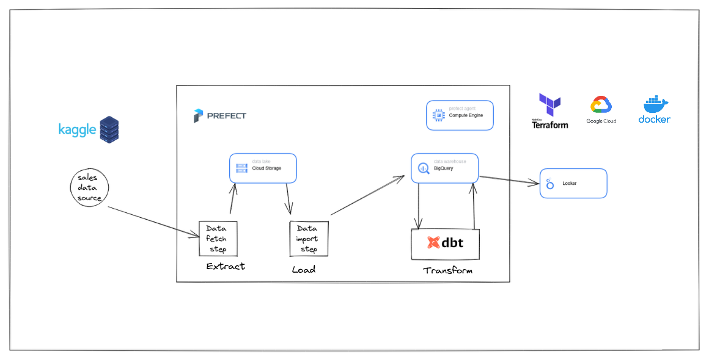

# Problem statement
This project aims at exploring how bussinesses can use data engineering tools to quickly setup and understand their operations better using data. By using data bussinesses can shift from making decsions from biased gut feeling to data leveraged insights.
Here are some example quetions ecommerse Bussiness operator would be interested in understanding.
- Sales: How much revenue is the eCommerce business generating? What are the top-selling products? What are the trends in sales over time?
- Customer Acquisition: How are customers finding the eCommerce business? What channels are most effective for acquiring new customers? What is the customer acquisition cost (CAC)?
- Inventory Management: How much inventory is available? What is the turnover rate for each product? What are the inventory carrying costs? What is the lead time for replenishing inventory?
- Shipping and Fulfillment: How long does it take to fulfill orders? What is the shipping cost for each order? What is the return rate? What is the customer satisfaction rate for shipping and fulfillment?


# Dataset
In this project we are using sales data as an example. Every day at the end of bussiness day, new sales data would be generated. And we can schedule batch job to generate insights.

We are using [eCommerce purchase history from electronics store](https://www.kaggle.com/datasets/mkechinov/ecommerce-purchase-history-from-electronics-store) data. This dataset contains purchase data from April 2020 to November 2020 from a large home appliances and electronics online store. 

## Overview


1. Data ingestion - Download dataset and ingest it in data lake(GCP Bucket)
2. Data warehouse - This data is imported into Big Query for performing anlytics.
3. Transformations - We are using dbt to transform data to suitable schema and store in BigQuery.
4. Dashboard - Looker Studio, formerly Google Data Studio is using as a dashboard to visualize the results.

## 1. Data ingestion
Data source contains single csv file of purchase history. 

Frequency of data download:
    since this is an static data from kaggle it can be imported only once. But in real usecase new data would be downloaded daily.

Extract step code is in [01_kaggle_dataset](./01_kaggle_dataset/)
And code for importing data into bigquery is in [02_gcp](./02_gcp/) 

## 2. Data warehouse
We are using BiqQuery as a Data Warehouse and it is used as data source in looker (Dashboard).

## 3. Transformations using dbt
DBT transformation code can be found in [04_dbt_project](./04_dbt_project/). 
The staging model has structure similar to data source. The `sales` table is partitioned on column `event_time` as this columns is frequently used to filter out relevent time period.

The core model sales_changes computes sales for diffrent time windows.


## 4. Dashboard 
Pdf of the dashboard can be found [here](./05_dashboard/DE_Sales_Report.pdf)
And here is access to dashboard [here](https://lookerstudio.google.com/s/nZ_rDTE-aZg)

The dashboard tries to answer following quetions
- what is monthly and daily sales trend.
- what is the peak hours of sales.
- Total sales for current year. 
- Total Number of orders for current year.
- Average order price
- Sales ranking by brand for last 4,12, 24 and 52 weeks.


## Steps to reproduce
___
### Prerequisites
- docker
- make

1. Clone the repository
2. Refres service-accounts auth token for this session

    `gcloud auth application-defualt login`
    

3. Initialize infrastructure using terraform
    change directory

    `cd terraform`

    initialize terraform

    `terraform init`

    Preview the changes to be applied

    `terraform plan -var="project=<gcp-project-id>"`

    Create new infra

    `terraform apply -var="project=<gcp-project-id>"`


    Delete infra after your work, to avoid cost on any running

    `terraform destroy`

4. Update variables in [make file](./Makefile)

- update kaggle api credentials dir  `KAGGLE_CREDENTIAL_DIR`
- and gcs credentials json file path `GCS_CREDENTIAL_JSON`
- add dockerhub base name for `PREFECT_CONTAINER_NAME` and    `DBT_CONTAINER_NAME`

- update gcp project id in [./04_dbt_project/docker-setup/.dbt/profiles.yml](./04_dbt_project/docker-setup/.dbt/profiles.yml)

5. Build the dockers

    `make docker-build-all`

    if running in cloud you might need to update docker repository name and run
    `docker-push-all`


6. Run prefect

    `make prefect-docker-compose-run`

7. Prefect GCS Block Setup
    GCP Credentials (gcp-cred)
    GCS Bucket (prefect-dtc-de-bucket)

8. Run the pipeline manually

    ```
    make run-kaggle-download-step
    make run-import-bq-step
    make dbt-docker-run
    ```

9. Setup Agent (local or VM)
    Local

    `make prefect-run-agent`
    
    Virtual Machine

    ```
    pip install -r prefect/requirements.txt
    prefect cloud login
    prefect agent start -q 'default'
    ```
10. Deploy the prefect pipelines
    update the following in [utils/create_blocks.py](./utils/create_blocks.py)
    repository_name : docker repository name
    gcs_key_json_path: path to gcs json file in the system
    dbt_profiles_dir: path to .dbt profiles dir example /home/.dbt
    kaggle_key_dir: .kaggle keys directory ex: /home/.kaggle


    and run 
    ```
    make prefect-run-agent
    make prefect-create-blocks
    make prefect-deploy-all
    ```

